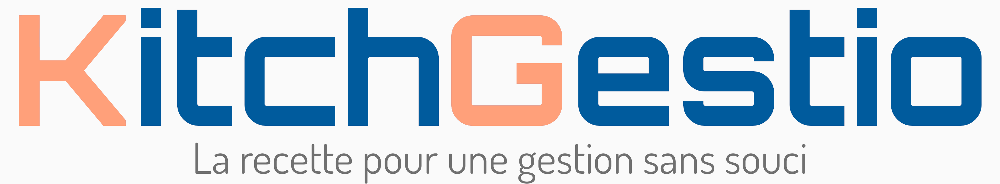

# Projet fil rouge

L'entreprise KitchGestio souhaite créer une application permettant à des organisations de gérer les stocks, les menus ainsi que les commandes de cuisines de collectivité dont elle a la charge.

    

## Expression des besoins

- L'application permettra la création de comptes d'organisation auxquels seront associés une ou plusieurs cuisines collective.
- 3 formules d'abonnement doivent exister : une formule gratuite permettant la gestion d'une seule cuisine, une formule intermédiaire permettant de gérer jusqu'à 5 cuisines, et une formule permettant de gérer jusqu'à 10 cuisines. Tarifs à déterminer.
- Le client souhaite aussi un compte Super Utilisateur permettant de gérer les informations des comptes créés, avec leur abonnement en cours, la date d'échéance de ses derniers, ainsi que les factures et l'état des paiements de chaque compte.

### Fonctionnalités du compte Organisation
- Créer les comptes Cuisine de son organisation (dans la limite de l'abonnement choisi), avec ses informations de connexions, un nom, une adresse, le nom du responsable.
- Attribuer un budget périodique à chaque cuisine que le compte gère
- Suivre l'activité de chaque cuisine :
  - état des stocks
  - dépenses
  - menus réalisés
  - alerte en cas de modification exceptionnelle des stocks
- Gérer la liste des fournisseurs et des produits que ces derniers proposent :
  - Chaque fournisseur devra avoir un nom, une adresse, un téléphone et une adresse mail, un numéro de TVA, un compte de paiement, ainsi que les jours de leurs tournées de livraison.
  - Chaque produit devra être associé à un fournisseur, avoir un nom, une description, une unité de mesure de commercialisation, la catégorie de produit à laquelle il appartient (viande, légume,...) le prix HT à l'unité de mesure.
- Gérer son abonnement et visualiser les factures liées au compte.

### Fonctionnalités du compte Cuisine
- Créer des fiches techniques de recette à partir des produits disponibles chez les fournisseurs, avec la liste des produits et les quantités nécessaires, le processus de réalisation de la recette, ainsi que le nombre de personne pouvant être servi pour les quantités données.
- Créer des menus datés à partir des fiches techniques créées, contenant les recettes qui seront réalisées, et les produits individuels qui seront servis (comme les laitages) et le nombre prévu de convives sur le jour donnée.
- Création automatique des bons de commandes en fonction des menus selectionnés, avec la possibilité de les ajuster et d'ajouter des produits si nécessaire.
- Création automatique des bons de sorties de marchandises en fonction du jour de service avec ajustement possible s' il y a un changement dans le nombre de convives ou si un produit est indisponible ou non disponible en quantité suffisante. Le bon de sorties comprendra la liste des produits, ainsi que le coût total et par convives du repas servi. Les produits sortis depuis un bon seront retirés des stocks.
- Création du bon de reception avec la possibilité d'ajuster les quantités livrées par le fournisseur ainsi que le prix. Les produits seront ajoutés au stock de la cuisine.
- Visualiser les stocks de la cuisine, avec la posibilité de faire des ajustements exceptionnels. Chaque ajustement déclenchera un message à destination de l'organisation pour l'avertir.

### Fonctionnalités du compte Super Utilisateur
- Gérer les informations des comptes créés (RGPD).
- Visualiser l'état des abonnements en cours, et modifier les abonnements.
- Visualiser les comptes en attente de paiement, avec la possibilité de suspendre les comptes.

## Stack Technique

- Frontend : ReactJS
- Backend : Laravel
- Base de données : SQL Server